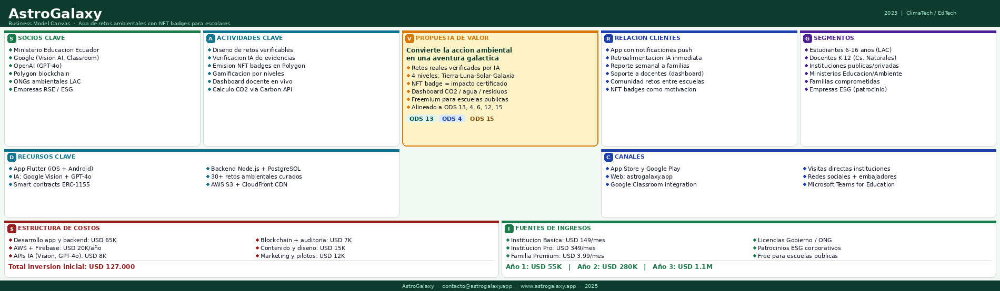

# 🌍 AstroGalaxy
### *Donde la conciencia ambiental se convierte en una aventura galáctica*

---

> **"Cada reto cumplido es un planeta que salvamos. Cada insignia ganada es un paso hacia un futuro sostenible."**

---

## 🌱 El Problema que Resolvemos

